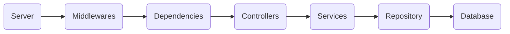
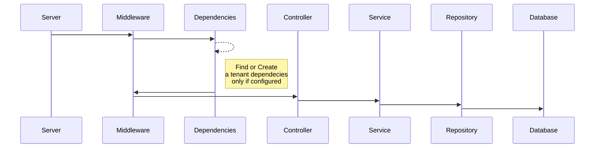

# CRUD Golang API Multitenancy MongoDB Fiber

### Requirements

- Go installed in the system
- A running instance of postgres db
- Update the `.env` file with the postgres path, db and credentials

Run the following command:
```
go run main.go
```
### Technologies used
- Fiber
- MongoDB

### App Flow
1. App creates Server.
2. Server create Middeware and routes.
3. Server receive request.
4. Middleware find or create tenant dependencies (Service, Repository, Database).
5. Middleware attach tenant dependecies at the request.
6. Controller get tenant dependecies.
7. Controller use Service dependency.
8. Service use Repository dependency.
9. Repository use Database repository.
10. Database use tenant database. 


## UML diagrams

### Components


### Sequence


### How Use
Configure the `configurations.json` file to connect to differents database per tenant.

Use the `request.http` to know how send request to api.

The `data` field can contains any schema of JSON, the api save and get without problems.
